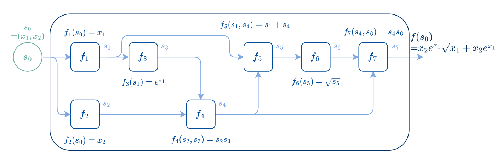

# Automatic Differentiation Labs

| Week  | Day        | Room   | File             |
|-------|------------|--------|------------------|
| S1    | 15/09/2025 | BARB02 | `lab_forward.jl` |
| S2    | 22/09/2025 | BARB02 | `lab_reverse.jl` |

## Setup

Before coming to the practice session, install the necessary software:

1. Install Julia: [recommended way](https://modernjuliaworkflows.org/writing/#installation)
2. Install VSCode with the Julia extension: see [here](https://modernjuliaworkflows.org/writing/#editor)

During the lab, run the file `lab_forward.jl` (S1) and `lab_forward.jl` (S2).
See [here](https://modernjuliaworkflows.org/writing/#running_code) for how to run a file.
In summary,
1. open the Julia REPL with `Alt + J` then `Alt + O`, then
2. activate the environment of the folter `lab-handout` either with
    * enter the Pkg mode with `]`, the prompt should now be blue. Then enter `activate lab-handout`, the prompt should now be `(lab-handout) pkg>`. Leave the Pkg prompt with a backspace.
    * or write `import Pkg; Pkg.activate("lab-handout")`.
3. Place your cursor on the first line of `lab.jl` and use `Shift + Enter` to execute the file line by line interactively like a notebook.

> [!WARNING]
> If you run the line `include("filename.jl")` to load the definition
> of methods, these won't get updated automatically when
> you modify the file. To update them, you need to run the
> `include` line again (or use `Revise.includet` as detailed [here](https://modernjuliaworkflows.org/writing/#running_code)).

## AD lab handout: First-order scalar AD, forward and reverse

### 1. Intro and objective 

Automatic Differentiation (AD) is a technique to compute the derivatives of a function with machine-precision accuracy, relying on its implementation. Theoretically, the only thing we do is decompose the function into elementary operations, and apply the Chain Rule (just as we would by hand).   
> *"Using the Chain Rule is like peeling an onion: you have to deal with each layer at a time, and if it's too big you'll start crying."* (Anonymous professor)

In this lab, we aim to build an onion-peeling machine. As we will see, it is relatively simple. Moreover, when built, we are able to peel varieties of onions, and we realize that peeled onions are widely used today.    

A classic example of AD application is the training of Neural Networks (NNs). NNs are parametrized functions, and *training* is the process of adjusting the parameters (the *weights*), so as to improve their average performance on some training data. More precisely, we minimize a *loss function* representing the cost of the model predictions being far from the actual target ($y$). In this lab, this loss function is chosen to be the mean square error (MSE), and we consider small two-layers NNs with different activation functions. 

%20=%20\frac{1}{m}%5C%7CXW_1W_2-y%5C%7C^2)    
%20=%20\frac{1}{m}%5C%7C%5Csigma(XW_1)W_2-y%5C%7C^2%20%5Cquad%5Ctext{where}%5Cquad[%5Csigma(M)]_%7Bij%7D%20:=%20%5Ctanh(M_%7Bij%7D))    
%20=%20\frac{1}{m}%5C%7C%5Csigma(XW_1)W_2-y%5C%7C^2%20%5Cquad%5Ctext{where}%5Cquad[%5Csigma(M)]_%7Bij%7D%20:=%20%5Coperatorname%7BReLU%7D(M_%7Bij%7D))    

During training, the weights (stored in matrices $W_1$ and $W_2$) are updated in an iterative manner, using classic numerical optimization methods (e.g. first-order Gradient Descent or variants). Gradient Descent basically consists in following the direction that locally guarantees steepest descent (i.e., the negative gradient). AD is used to automatically get the values of this gradient $\nabla_{W_1, W_2} \mathcal{L}$, in a step that is often called *backpropagation*.

### 2. Forward mode and Reverse mode AD

As was already said above, AD is nothing but automatically applying the Chain Rule on elementary operations composing the function. If our function $f$ is written 
%20=%20(f_K%20%5Ccirc%20f_%7BK-1%7D%20%5Ccirc%20%5Ccdots%20%5Ccirc%20f_2%20%5Ccirc%20f_1)(x)),
we know   

Therefore, to get the derivative of function $f$, it suffices to multiply the *local jacobians* of the elementary operations composing $f$. And these jacobian matrices can be multiplied in any order. In practice, only the two main options are often considered: multiplying from right to left, which is called the *Forward mode*, or from left to right, which is called the *Reverse mode*. If we visualize the function as a graph (specifically, a Directed Acyclic Graph (DAG), and referred to as the *expression graph*), the Forward mode corresponds to propagating the derivatives from left to right, and Reverse mode from right to left in the graph.     

Each node of the expression graph corresponds to a basic operation in the composition. An example of such a representation of the function %20=%20x_2%20e%5E%7Bx_1%7D%20%5Csqrt%7Bx_1%20+%20x_2%20e%5E%7Bx_1%7D%7D)
as a DAG is given below (Source: [2]). 

  

Both implementations are explained below, and should be completed in the `forward.jl` and `reverse.jl` code files respectively.

**A. Forward mode**: The Forward mode is the most intuitive. It follows the natural order of the elementary operations: starting from the leaves of the DAG (the variables) and their local jacobians, and propagating directional derivatives from left to right in the graph. Note that we said **directional** derivatives. Indeed, each forward pass through the expression graph starts with a direction $u$, and computes
$$ v^{(i)} = \textbf{J}f_{i}\left(x^{(i-1)}\right)v^{(i-1)}\quad\text{for }i=0,\dots,K,\quad\text{from }v^{(0)}=u\text{ until }v^{(K)}=v, $$
where $\textbf{J}f_{i} \left(x^{(i-1)}\right)$ denotes the jacobian matrix of function $f_i$, evaluated at $x^{(i-1)}$.

For some applications, only a directional derivative (sometimes called Jacobian Vector Product (JVP)) is needed. When the entire gradient of a function of $n$ variables (or the Jacobian if the function has multiple outputs) is requested, we simply perform $n$ forward passes, with directions $u=e_i$ for $i$ from $1$ to $n$.    

The implementation consists in:  
1. Defining *Dual numbers*, holding both the value of a function **and** the value of the derivative. 
2. Redefining all elementary operations on Dual numbers (so that each time that an operation is called, both the result and the associated derivative are computed). The definitions come from the simple rules of calculus (derivative of a sum, product rule, derivative of a power, etc).

**B. Reverse mode**: The Reverse mode is less intuitive, but worth it. It consists of:
1. A forward pass (from left to right in the expression graph), during which the value of the function is computed, as well as all the intermediate results of the elementary operations. Let's denote these intermediate results $s_i$ (result after function $f_i$).
2. A backward pass (from right to left), during which the derivative of the function with respect to the intermediate results is propagated backward. This backpropagation consists of multiplying the previous result at each stage by the local Jacobian of the elementary operation in question. When we reach the left end of the expression graph, we have computed the desired derivative, with respect to the variables $x$.   
When starting a backward pass from the right end of the graph, one specific output function must be chosen. Said differently, if the function $f$ has $m$ outputs, $m$ backward passes are needed in Reverse mode to get the entire Jacobian of $f$.   

Note that the forward pass is always necessary (even if the function values are not requested and only the derivative values are). Indeed, the local jacobians used in the backward pass (for some operations) do depend on the function values (which are computed during the forward pass).   
Finally, we would like to quickly draw your attention to the order in which the nodes of the graph are visited. Since the expression graph is a DAG (and not necessarily a tree), it is important that to define an order of visit, so that no nodes are visited before any of their parents during the backward pass. This is ensured by the `topo_sort` function in the code. 

> [!NOTE]
> * In `reverse.jl`, when creating the expression graph, we construct a Node for each of the variables and constants of the expression. Are the derivatives with respect to ALL these Nodes useful? If not, modify the code so as to avoid the unnecessary computations.
> * In `reverse.jl`, the local jacobians are computed and stored during the backward pass. This means that we have to check the symbol of the operation of each Node during the backward pass, implying a costly if-else during the backward pass. Note however that the local jacobians could be computed during the forward pass (in which we have to check (if-else) the symbol of the operation of each Node anyway), and stored in their respective Nodes. Then the backward pass would only consists of multiplying the local jacobians together, with no need to know the symbols. The backward pass is therefore faster. Modify the code so as to implement this 'jacobian-storing' version of Reverse mode. Is there any downside to this version?  

### 3. Code files
* `forward.jl` : implements the forward mode AD.
* `reverse.jl`: implements the reverse mode AD.
* `lab_forward.jl`: tests your forward AD on example loss functions.
* `lab_reverse.jl`: tests your reverse AD on example loss functions.
* `models.jl`: defines the models and activation functions of the loss functions.
* `train.jl`: implements a simple Gradient Descent for training.

> [!NOTE]
> The AD interface implemented by `reverse` and `forward` is chosen so as to
> match [DifferentiationInterface](https://juliadiff.org/DifferentiationInterface.jl/DifferentiationInterface/stable/api/#DifferentiationInterface.hvp)
> That way, you could also easily try out other backends as well.
> Note that their implementation may not be as readable as the lab solutions that
> we will provide though because these backends favor efficiency and large coverage
> the part of Julia they support while we favor simplicity to be didactical.

### 4. Further readings and references
[1] *Evaluating Derivatives*, A. Griewank and A. Walther   
[2] *The Elements of Differentiable Programming*, M. Blondel, V. Roulet    
[3] 3Blue1Brown, https://www.3blue1brown.com/?v=chain-rule-and-product-rule, https://www.3blue1brown.com/?v=neural-networks, https://www.3blue1brown.com/lessons/backpropagation#title 
